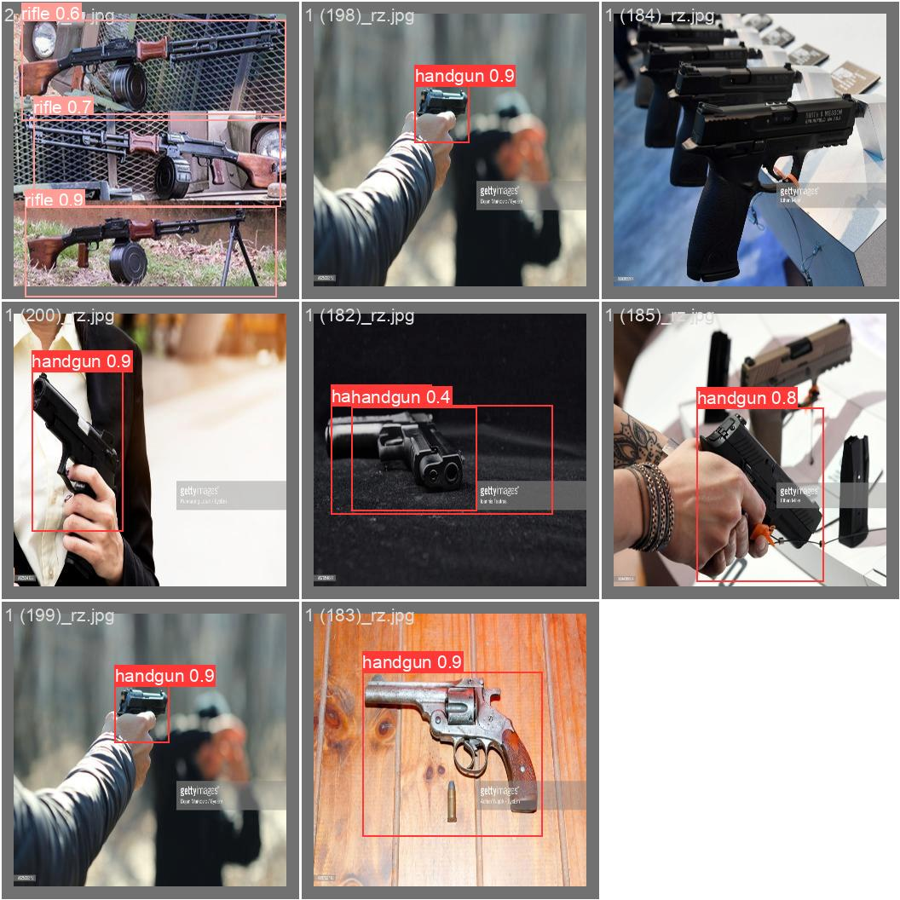

# YoLo5 : Guns detection implementation

## Introduction

This is a PyTorch **Ultranlytics Yolo5** based implementation is trained to detect handguns and rifles. The implementation also includes a dataset conversion script (**convert_voc_to_yolo.py**) to resize and convert a PascalVOC dataset to YoLo format.

A sample of dataset images and annotations is included

guns_yolo5 (dataset)  
  |  
  |- images  
  |   |-train  
  |   | L Training Images.jpeg  
  |   L-test  
  |       Test Images.jpeg 
  |- labels
      |-train  
      | L Training annotations.txt  
      |- test  
         L Test annotations.txt  

Training Metrics  
   

Some test examples are as below  
   
   
  

## Author : Kuljeet Singh